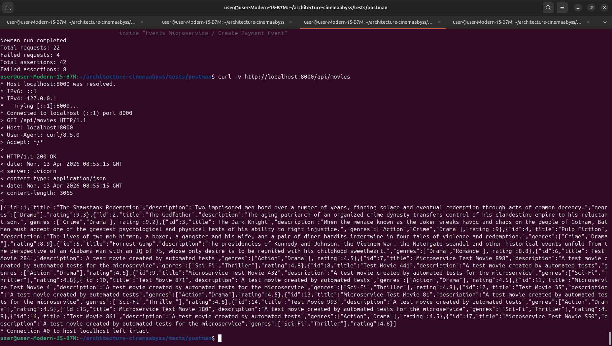

## Изучите [README.md](.\README.md) файл и структуру проекта.

### Задание 1: Проектирование архитектуры

## 1. Идентификация доменов:

На основе описания сущностей в текущей системе и функциональности, можно выделить следующие ключевые домены:

*   **Пользовательский домен (User Management):** Отвечает за регистрацию, аутентификацию, профили пользователей, роли и разграничение доступа.
*   **Платежный домен (Billing/Payment):** Обрабатывает все операции, связанные с оплатой подписки, скидками, биллингом и интеграцией с платёжными системами.
*   **Домен подписок (Subscription):** Управляет типами подписок, статусами, правами доступа к контенту и интеграцией с системами лояльности.
*   **Домен видео/контента (Video/Content):** Отвечает за хранение информации о доступном видео-контенте, его статусе, URL-адресах потоковой передачи и управление каталогом.
*   **Домен метаданных (Metadata):** Этот домен уже выделен как цель для первого шага рефакторинга. Он содержит информацию о фильмах, сериалах: жанры, актёры, оценки пользователей, описания и т.д.
*   **Домен рекомендаций (Recommendation):** Интегрируется с внешней рекомендательной системой или внутренним сервисом для предоставления персонализированных подборок.
*   **Домен взаимодействия с пользователем (Interaction):** Обрабатывает действия пользователей, такие как оценки, добавление в избранное, создание плейлистов.
*   **API Шлюз (API Gateway):** Единая точка входа для всех клиентских запросов. Отвечает за маршрутизацию, аутентификацию токенов, логирование, мониторинг и частичную обработку данных для конкретных клиентов (мобильные, TV, веб).


## 2. Организация интеграционного взаимодействия:
Для обеспечения слабой связанности между микросервисами и обработки асинхронных операций (например, обновление рекомендаций после оценки фильма), целесообразно использовать шину сообщений. В требованиях явно указано использование Kafka, которое будет реализовано как центральный компонент для асинхронного обмена событиями между сервисами.

## 3. Единая точка вызова:
API Gateway будет выполнять роль единой точки вызова. Все внешние клиенты (мобильные приложения, веб-интерфейс, приложения для Smart TV) будут взаимодействовать с внутренними микросервисами исключительно через него. Это упрощает клиентскую сторону, централизует безопасность и позволяет адаптировать ответы под конкретный тип клиента.

## 4. Диаграмма C4:
Ниже представлена текстовая концепция диаграммы.
    Система: Кинобездна
    Контейнеры:
        Клиенты:
            Мобильное приложение (Контейнер)
            Веб-браузер (Контейнер)
            Приложение Smart TV (Контейнер)
    Инфраструктура:
        Kubernetes Cluster (Контейнер, обводит следующие внутренние контейнеры)
        API Gateway (Контейнер внутри K8s)
        Kafka (Контейнер внутри K8s)
        База данных PostgreSQL (Контейнер внутри K8s, возможно, несколько для разных доменов или через сервисы данных)
        Хранилище объектов (S3/MinIO) (Контейнер внутри K8s, для видеофайлов, изображений)
    Микросервисы (Контейнеры внутри K8s):
        User Service
        Billing Service
        Subscription Service
        Video Content Service
        Metadata Service
        Recommendation Service (взаимодействует с внешней системой)
        Interaction Service
    Внешние системы:
        Внешняя Рекомендательная Система (Система)
        Платёжные Системы (Система)
        Системы Лояльности (Система)

**Связи:**

*   Клиенты -> API Gateway (HTTPS)
*   API Gateway -> User Service, Video Content Service, Metadata Service, Subscription Service, Interaction Service (HTTP/gRPC)
*   User Service -> Kafka (Producer/Consumer)
*   Video Content Service -> Kafka, Metadata Service, Хранилище объектов
*   Metadata Service -> Kafka, База данных
*   Subscription Service -> Kafka, Billing Service
*   Billing Service -> Kafka, Платёжные Системы
*   Interaction Service -> Kafka, Metadata Service
*   Recommendation Service -> Kafka (Consumer для событий взаимодействия), Внешняя Рекомендательная Система

 [ C4_Container](https://github.com/KIProkopenko/architecture-cinemaabyss/blob/cinema/C4_Container.puml)

    


# Задание 2

### 1. Proxy




### 2. Kafka


Необходимые тесты для проверки этого API вызываются при запуске npm run test:local из папки tests/postman 
Приложите скриншот тестов и скриншот состояния топиков Kafka из UI http://localhost:8090 

# Задание 3

Команда начала переезд в Kubernetes для лучшего масштабирования и повышения надежности. 
Вам, как архитектору осталось самое сложное:
 - реализовать CI/CD для сборки прокси сервиса
 - реализовать необходимые конфигурационные файлы для переключения трафика.


### CI/CD


### Proxy в Kubernetes


#### Шаг 3


Добавьте сюда скриншота вывода при вызове https://cinemaabyss.example.com/api/movies и  скриншот вывода event-service после вызова тестов.


# Задание 4
Для простоты дальнейшего обновления и развертывания вам как архитектуру необходимо так же реализовать helm-чарты для прокси-сервиса и проверить работу 

Для этого:
1. Перейдите в директорию helm и отредактируйте файл values.yaml

```yaml
# Proxy service configuration
proxyService:
  enabled: true
  image:
    repository: ghcr.io/db-exp/cinemaabysstest/proxy-service
    tag: latest
    pullPolicy: Always
  replicas: 1
  resources:
    limits:
      cpu: 300m
      memory: 256Mi
    requests:
      cpu: 100m
      memory: 128Mi
  service:
    port: 80
    targetPort: 8000
    type: ClusterIP
```

- Вместо ghcr.io/db-exp/cinemaabysstest/proxy-service напишите свой путь до образа для всех сервисов
- для imagePullSecret проставьте свое значение (скопируйте из конфигурации kubernetes)
  ```yaml
  imagePullSecrets:
      dockerconfigjson: ewoJImF1dGhzIjogewoJCSJnaGNyLmlvIjogewoJCQkiYXV0aCI6ICJaR0l0Wlhod09tZG9jRjl2UTJocVZIa3dhMWhKVDIxWmFVZHJOV2hRUW10aFVXbFZSbTVaTjJRMFNYUjRZMWM9IgoJCX0KCX0sCgkiY3JlZHNTdG9yZSI6ICJkZXNrdG9wIiwKCSJjdXJyZW50Q29udGV4dCI6ICJkZXNrdG9wLWxpbnV4IiwKCSJwbHVnaW5zIjogewoJCSIteC1jbGktaGludHMiOiB7CgkJCSJlbmFibGVkIjogInRydWUiCgkJfQoJfSwKCSJmZWF0dXJlcyI6IHsKCQkiaG9va3MiOiAidHJ1ZSIKCX0KfQ==
  ```

2. В папке ./templates/services заполните шаблоны для proxy-service.yaml и events-service.yaml (опирайтесь на свою kubernetes конфигурацию - смысл helm'а сделать шаблоны для быстрого обновления и установки)

```yaml
template:
    metadata:
      labels:
        app: proxy-service
    spec:
      containers:
       Тут ваша конфигурация
```

3. Проверьте установку
Сначала удалим установку руками

```bash
kubectl delete all --all -n cinemaabyss
kubectl delete  namespace cinemaabyss
```
Запустите 
```bash
helm install cinemaabyss .\src\kubernetes\helm --namespace cinemaabyss --create-namespace
```
Если в процессе будет ошибка
```code
[2025-04-08 21:43:38,780] ERROR Fatal error during KafkaServer startup. Prepare to shutdown (kafka.server.KafkaServer)
kafka.common.InconsistentClusterIdException: The Cluster ID OkOjGPrdRimp8nkFohYkCw doesn't match stored clusterId Some(sbkcoiSiQV2h_mQpwy05zQ) in meta.properties. The broker is trying to join the wrong cluster. Configured zookeeper.connect may be wrong.
```

Проверьте развертывание:
```bash
kubectl get pods -n cinemaabyss
minikube tunnel
```

Потом вызовите 
https://cinemaabyss.example.com/api/movies

и приложите скриншот развертывания helm и вывода https://cinemaabyss.example.com/api/movies


## Удаляем все

```bash
kubectl delete all --all -n cinemaabyss
kubectl delete namespace cinemaabyss
```
